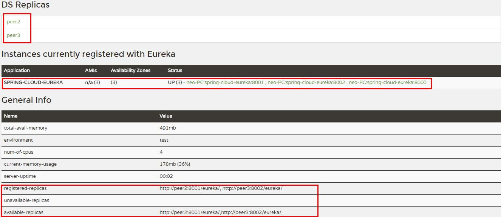

# 注册中心Eureka
>Eureka是Netflix开源的一款提供服务注册和发现的产品，它提供了完整的Service Registry和Service Discovery实现。也是springcloud体系中最重要最核心的组件之一。
## 集群
注册中心这么关键的服务，如果是单点话，遇到故障就是毁灭性的。在一个分布式系统中，服务注册中心是最重要的基础部分，理应随时处于可以提供服务的状态。为了维持其可用性，使用集群是很好的解决方案。Eureka通过互相注册的方式来实现高可用的部署，所以我们只需要将Eureke Server配置其他可用的serviceUrl就能实现高可用部署。
### eureka集群使用
在生产中我们可能需要三台或者大于三台的注册中心来保证服务的稳定性，配置的原理其实都一样，将注册中心分别指向其它的注册中心。这里只介绍三台集群的配置情况，其实和双节点的注册中心类似，每台注册中心分别又指向其它两个节点即可，使用application.yml来配置。
```properties
eureka.client.register-with-eureka: true
eureka.client.fetch-registry: true
---
spring:
  application:
    name: eureka-cluster
  profiles: peer1
server:
  port: 8000
eureka:
  instance:
    hostname: peer1
  client:
      serviceUrl:
        defaultZone: http://peer2:8001/eureka/,http://peer3:8002/eureka/
---
spring:
  application:
    name: eureka-cluster
  profiles: peer2
server:
  port: 8001
eureka:
  instance:
    hostname: peer2
  client:
      serviceUrl:
        defaultZone: http://peer1:8000/eureka/,http://peer3:8002/eureka/
---
spring:
  application:
    name: eureka-cluster
  profiles: peer3
server:
  port: 8002
eureka:
  instance:
    hostname: peer3
  client:
      serviceUrl:
        defaultZone: http://peer1:8000/eureka/,http://peer2:8001/eureka/
```
#### 配置本机hosts
```properties
127.0.0.1 peer1  
127.0.0.1 peer2
127.0.0.1 peer3
```
#### 分别以peer1、peer2、peer3的配置参数启动eureka注册中心。
```properties
java -jar spring-cloud-eureka-0.0.1-SNAPSHOT.jar --spring.profiles.active=peer1
java -jar spring-cloud-eureka-0.0.1-SNAPSHOT.jar --spring.profiles.active=peer2
java -jar spring-cloud-eureka-0.0.1-SNAPSHOT.jar --spring.profiles.active=peer3
```
#### 依次启动完成后，浏览器输入：http://localhost:8000/ 效果图如下：

#### 注意事项
* 在搭建 Eureka Server 双节点或集群的时候，要把eureka.client.register-with-eureka和eureka.client.fetch-registry均改为true（默认）。否则会出现实例列表为空，且 peer2 不在 available-replicas 而在 unavailable-replicas 的情况（这时其实只是启动了两个单点实例）。


