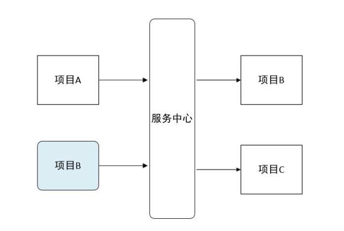
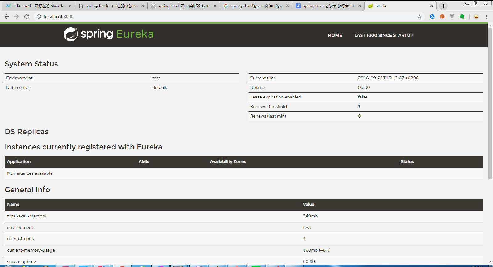

# 注册中心Eureka（jv`rika）
>Eureka是Netflix开源的一款提供服务注册和发现的产品，它提供了完整的Service Registry和Service Discovery实现。也是springcloud体系中最重要最核心的组件之一。
## 背景介绍
### 服务中心
&ensp;&ensp;&ensp;&ensp;服务中心又称注册中心，管理各种服务功能包括服务的注册、发现、熔断、负载、降级等，比如dubbo admin后台的各种功能。
### 基本架构
#### 下图简要描述了Eureka的基本架构，由3个角色组成：

* Eureka Server  
  * 提供服务注册和发现
* Service Provider  
  * 服务提供方  
  * 将自身服务注册到Eureka，从而使服务消费方能够找到
* Service Consumer  
  * 服务消费方  
  * 从Eureka获取注册服务列表，从而能够消费服务
## 案例实践
### Eureka Server
#### 1、pom中添加依赖
```xml
<dependencies>
		<dependency>
		<groupId>org.springframework.cloud</groupId>
		<artifactId>spring-cloud-starter-eureka-server</artifactId>
	</dependency>
		<dependency>
			<groupId>org.springframework.boot</groupId>
			<artifactId>spring-boot-starter-test</artifactId>
			<scope>test</scope>
		</dependency>
	</dependencies>
	<dependencyManagement>
		<dependencies>
			<!--spring-cloud-dependencies也是一个依赖管理器的pom文件，与spring-boot-starter-parent的作用一样，
			不同的是spring-cloud-dependencies是对cloud的依赖管理。如：spring-cloud-starter-config、
			spring-cloud-starter-netflix-eureka-server-->
			<dependency>
				<groupId>org.springframework.cloud</groupId>
				<artifactId>spring-cloud-dependencies</artifactId>
				<version>${spring-cloud.version}</version>
				<type>pom</type>
				<scope>import</scope>
			</dependency>
		</dependencies>
	</dependencyManagement>
```
#### 2、添加启动代码中添加@EnableEurekaServer注解
```java
@SpringBootApplication
@EnableEurekaServer
public class SpringCloudEurekaApplication {

	public static void main(String[] args) {
		SpringApplication.run(SpringCloudEurekaApplication.class, args);
	}
}
```
#### 3、配置文件
在默认设置下，该服务注册中心也会将自己作为客户端来尝试注册它自己，所以我们需要禁用它的客户端注册行为，在application.properties添加以下配置：
```properties
spring.application.name=spring-cloud-eureka

server.port=8000
eureka.client.register-with-eureka=false
eureka.client.fetch-registry=false

eureka.client.serviceUrl.defaultZone=http://localhost:${server.port}/eureka/ 
```
* eureka.client.register-with-eureka ：表示是否将自己注册到Eureka Server，默认为true。
* eureka.client.fetch-registry ：表示是否从Eureka Server获取注册信息，默认为true。
* eureka.client.serviceUrl.defaultZone ：设置与Eureka Server交互的地址，查询服务和注册服务都需要依赖这个地址。默认是http://localhost:8761/eureka ；多个地址可使用 , 分隔。  
##### 启动工程后，访问：http://localhost:8000/，可以看到下面的页面，其中还没有发现任何服务


    


  


