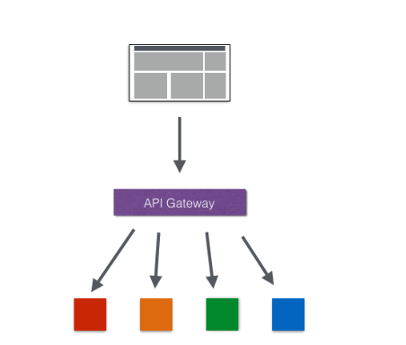
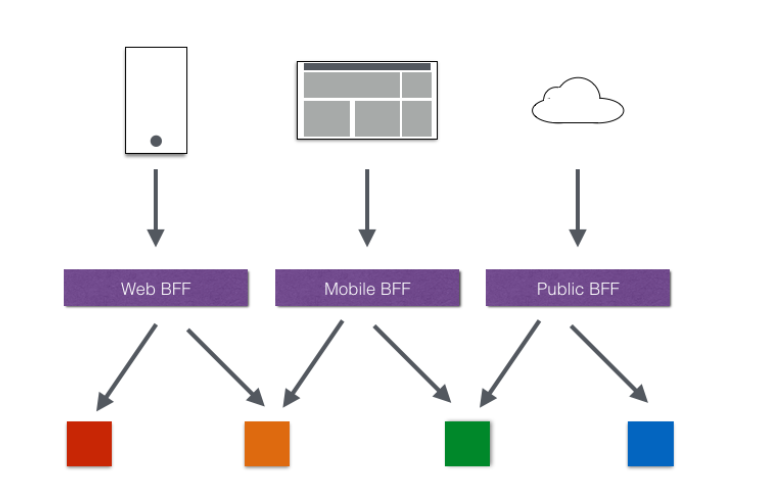
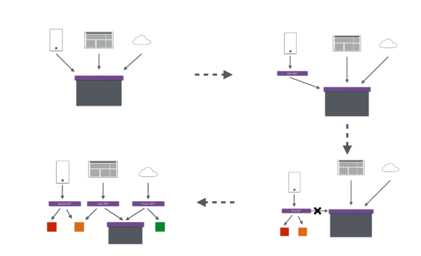

# 服务网关zuul初级篇 
> 在微服务架构中，后端服务往往不直接开放给调用端，而是通过一个API网关根据请求的url，路由到相应的服务。当添加API网关后，在第三方调用端和服务提供方之间就创建了一面墙，这面墙直接与调用方通信进行权限控制，后将请求均衡分发给后台服务端
### 为什么需要API Gateway
* 简化客户端调用复杂度   
  在基于微服务的项目中为了简化前端的调用逻辑，通常会引入API Gateway作为轻量级网关，同时API Gateway中也会实现相关的认证逻辑从而简化内部服务之间相互调用的复杂度。
  
* 数据裁剪以及聚合   
  为了优化客户端的使用体验，API Gateway可以对通用性的响应数据进行裁剪以适应不同客户端的使用需求。同时还可以将多个API调用逻辑进行聚合，从而减少客户端的请求数，优化客户端用户体验
* 多渠道支持   
  当然我们还可以针对不同的渠道和客户端提供不同的API Gateway,对于该模式的使用由另外一个大家熟知的方式叫Backend for front-end, 在Backend for front-end模式当中，我们可以针对不同的客户端分别创建其BFF，进一步了解BFF可以参考这篇文章：Pattern: Backends For Frontends
  
* 遗留系统的微服务化改造   
  对于系统而言进行微服务改造通常是由于原有的系统存在或多或少的问题，比如技术债务，代码质量，可维护性，可扩展性等等。API Gateway的模式同样适用于这一类遗留系统的改造，通过微服务化的改造逐步实现对原有系统中的问题的修复，从而提升对于原有业务响应力的提升。通过引入抽象层，逐步使用新的实现替换旧的实现。
  
## Spring Cloud Zuul
> Spring Cloud Zuul路由是微服务架构的不可或缺的一部分，提供动态路由，监控，弹性，安全等的边缘服务。Zuul是Netflix出品的一个基于JVM路由和服务端的负载均衡器。
### 使用
#### 1.添加依赖
  ```xml
  <!--注册为Zuul：引入spring-cloud-starter-zuul-->
  <dependency>
  	<groupId>org.springframework.cloud</groupId>
  	<artifactId>spring-cloud-starter-zuul</artifactId>
  </dependency>
  <!--注册为Eureka实例-->
  <dependency>
  			<groupId>org.springframework.cloud</groupId>
  			<artifactId>spring-cloud-starter-eureka</artifactId>
  </dependency>
  ```
#### 2.配置文件
```properties
spring.application.name=gateway-service-zuul
server.port=8888
#方法一：通过url配置
#这里的配置表示，访问/it/** 直接重定向到http://www.ityouknow.com/**
zuul.routes.baidu.path=/it/**
zuul.routes.baidu.url=http://www.ityouknow.com/

#方法二：通过注册中心配置
#zuul.routes.api-a.path=/producer/**
#zuul.routes.api-a.serviceId=spring-cloud-producer
eureka.client.serviceUrl.defaultZone=http://localhost:8000/eureka/

```  
#### 3、启动类
```java
@SpringBootApplication
//启动类添加@EnableZuulProxy，支持网关路由。
@EnableZuulProxy
public class GatewayServiceZuulApplication {

	public static void main(String[] args) {
		SpringApplication.run(GatewayServiceZuulApplication.class, args);
	}
}
```
### 优化
* 调用producer服务并且做了均衡负载
#### 网关的默认路由规则
但是如果后端服务多达十几个的时候，每一个都这样配置也挺麻烦的，spring cloud zuul已经帮我们做了默认配置。默认情况下，Zuul会代理所有注册到Eureka Server的微服务，并且Zuul的路由规则如下：http://ZUUL_HOST:ZUUL_PORT/微服务在Eureka上的serviceId/**会被转发到serviceId对应的微服务。
  


    


  


